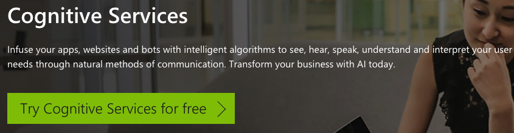
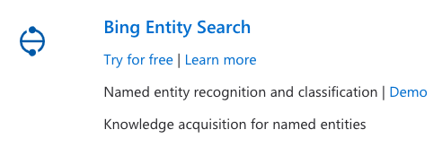
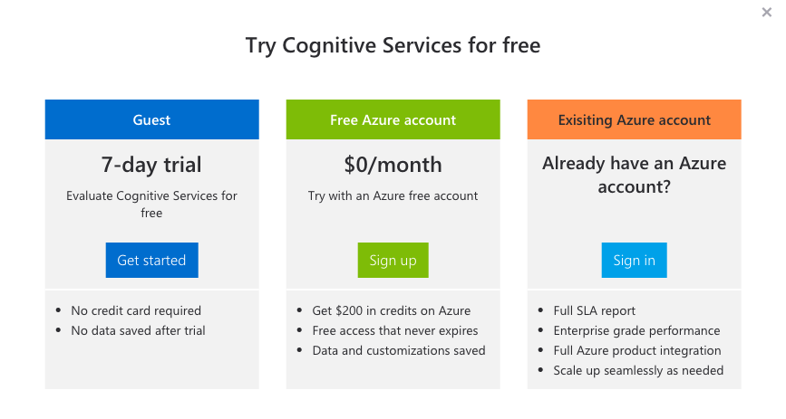
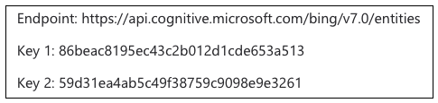
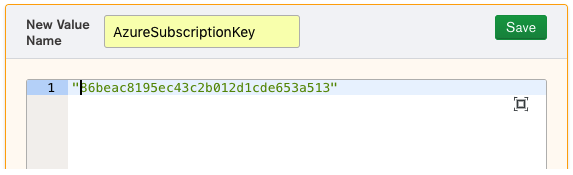
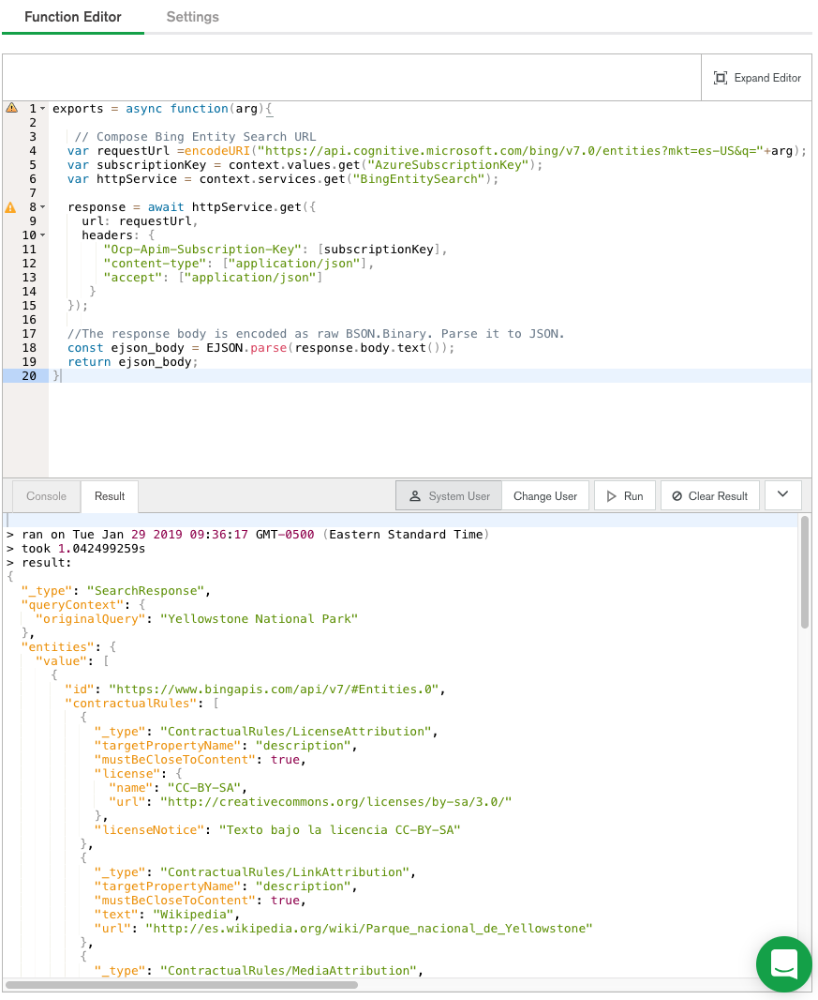
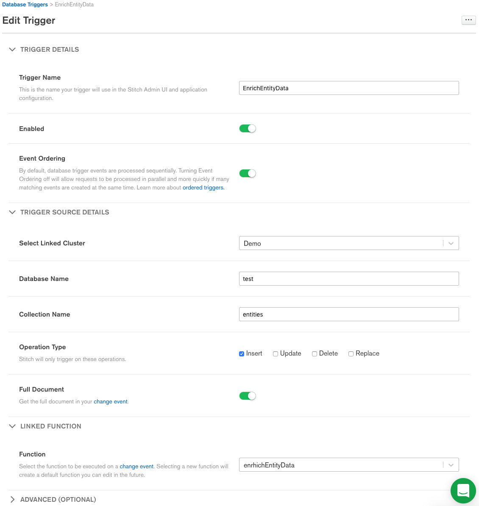
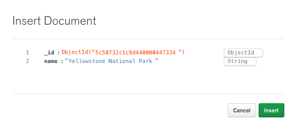
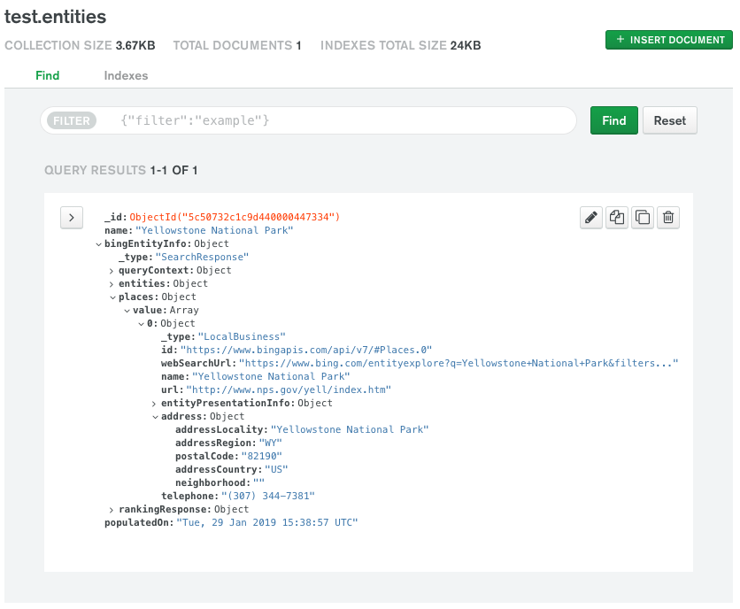

# Using the Azure Cognitive Services in MongoDB Stitch

Microsoft Azure provides some pretty powerful [Congnitive Services](https://azure.microsoft.com/en-us/services/cognitive-services). Here I'll so you how you can leverage those services from MongoDB Stitch. 

## Get Azure API Keys
Of course to tall the Azure APIs, you need a set of keys. Navigate to the [Azure Congnitive Services](https://azure.microsoft.com/en-us/services/cognitive-services).



Click the **Try Cognitive Services** for free. You can browse the various services that are available. Find your way to the Bing Entity Search under Search APIs:



Click Try for free.



If you have existing Azure account, Sign In, otherwise, select the **7-day trial** option.

You will be issued a set of subscription keys, which we’ll save in the next step:



## Save the Azure Subscription Key
We’ll save subscription the key in a [Stitch Value](https://docs.mongodb.com/stitch/reference/values/), which is simply a named constant that you can use in Stitch functions and rules.

In the Stitch UI, Click Values on the left and then **New Value**. Name the value **AzureSubscriptionKey** and paste either one of your key values. Enclose the key value in quotes:



## Add Stitch HTTP Service
We need to add an [HTTP Service](https://docs.mongodb.com/stitch/services/http/) in order to interact with the Azure service from Stitch. Click **Services** on the left and **Add a Service**. Select **HTTP** as the service type and name the service **BingEntitySearch**. In the next step we’ll reference this service from our function code.

## Create the Entity Search Function
For this example, when the name of an entity is entered into a MongoDB collection, we'll call the Bing Entity Search API to enrich that document with the information Bing knows about the entity.

Click **Functions** on the left and **Create New Function**. Name the function **getBingEntityInfo**. Replace the example code with the following:
```es6
exports = async function(arg){

   // Compose Bing Entity Search URL
  var requestUrl =encodeURI("https://api.cognitive.microsoft.com/bing/v7.0/entities?mkt=es-US&q="+arg);
  var subscriptionKey = context.values.get("AzureSubscriptionKey");
  var httpService = context.services.get("BingEntitySearch");
  
  response = await httpService.get({
    url: requestUrl,
    headers: {
       "Ocp-Apim-Subscription-Key": [subscriptionKey],
       "content-type": ["application/json"],
       "accept": ["application/json"]
     }
  });
     
  //The response body is encoded as raw BSON.Binary. Parse it to JSON.
  const ejson_body = EJSON.parse(response.body.text());
  return ejson_body;
}
```
Click **Run** to verify the function works. The default argument is “Hello world!”, but that will still return results. Feel free to change the argument to anything you like.



## Create a Trigger to Enrich Documents
Now that we can get entity information, let's create a trigger that will enrich new documents with that information. 

Click the **Triggers** menu on the left and **Add a Database Trigger**. 

Name the trigger **EnrichEntityData**. For my example, the trigger source is going to be an **entites** collection in the **test** database and I'm only going to trigger on Inserts (be careful when triggering on updates not to get into a continuous update loop).



The trigger function **enrichEntityData** is as follows:

```es6
exports = async function(changeEvent) {
  
  var fullDocument = changeEvent.fullDocument;
  var collection = context.services.get("mongodb-atlas")
    .db("test").collection("entities");
    
  var result = await context.functions.execute("getBingEntityInfo", fullDocument.name);  
  console.log(result);
  fullDocument.bingEntityInfo = result;
  fullDocument.populatedOn = Date();

  var status = collection.updateOne({_id:fullDocument._id}, {$set:{bingEntityInfo:result, populatedOn:Date()}});
  console.log(status);
  
  return status;
    
}
```
## Validate
Now when you insert a document into the test.entities collection:



It will be enriched with the Bing entity information:



